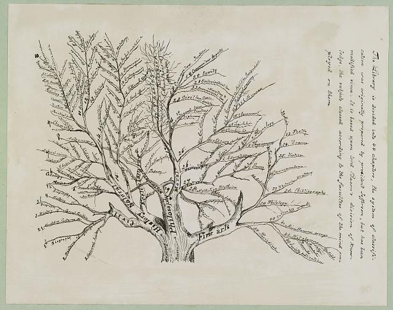

# Jefferson Library Classification

## History

This dataset contains a machine-readable version of Thomas Jefferson's Classification System. The Classification was created by Jefferson to organize his personal library which eventually became the Library Of Congress (LOC) in 1815. The LOC continued to use the classification until replaced by the Library of Congress Classification (LCC) in 1897.

Catalogs of Jefferson's libraries and its classification have been preserved in at least four versions.  The Massachusetts Historical Society compiled a [Timeline of Jefferson's Catalog](https://www.masshist.org/thomasjeffersonpapers/catalog1783/catalog_timeline.php).

### 1783

The *1783 Catalog of Books* is a handwritten list of books in Thomas Jefferson's personal library, eventually sold to the Library of Congress in 1815. Jefferson started the catalog after his first library was destroyed by fire in 1770. The 246-pages manuscript dates from circa 1775-1812. A [digitized version](https://www.masshist.org/thomasjeffersonpapers/catalog1783) is available. Jefferson outlined his classification on pages [10](https://www.masshist.org/thomasjeffersonpapers/doc?id=catalog1783_10), [11](https://www.masshist.org/thomasjeffersonpapers/doc?id=catalog1783_11), and [12](https://www.masshist.org/thomasjeffersonpapers/doc?id=catalog1783_10).

### 1815

Jefferson created a handwritten copy of his catalog around 1812 and offered his collection to the destroyed Library of Congress. George Watterston, the Librarian of Congress, published the printed catalog in 1815. He kept Jefferson's chapters but listed books in each chapter alphabetically. The catalog [has been digitized](http://hdl.loc.gov/loc.rbc/Jefferson.04556.2) with the classification depicted on page [6](https://www.loc.gov/resource/rbc0001.2007jeff04556/?sp=6) and [7](https://www.loc.gov/resource/rbc0001.2007jeff04556/?sp=7).

### 1823

In 1823 Nicholas Philip Trist, Jefferson's private secretary and grandson-in-law, recreate the 1812 Catalog which had been modified by Watterston. Trist's manuscript was rediscovered in the 1980s and [has been digitized](https://www.wdl.org/en/item/3000/) later. Jefferson's classification is not included explicitly but only as chapter headings. The Thomas Jefferson Foundation [refers to the 1815 classifcation](http://tjlibraries.monticello.org/transcripts/trist/trist.html) as table of contents of the Trist catalog.

### 1829

After selling his personal library to the Library of Congress, Jefferson assembled a new collection which was sold after his death. The catalog of this library, printed in as auction catalog 1829, contains the classification at page 3. The catalog [has been digizized](https://www.thehenryford.org/collections-and-research/digital-collections/artifact/384739/) by the Henry Ford Archive.

### 1900 

Another expression of Jefferson's classification has been given around 1900 [in an image](https://www.loc.gov/resource/ds.09241/) that depicts the classification as tree.

## Metadata

The classifcation has been entered in Wikidata as ... and in BARTOC as ...

## License

All digitized content used and included in this data set is out of copyright.

## References

* *1783 Catalog of Books* (circa 1775-1812), page 10-12
* (1815), page 6-7
* *Manuscript Catalogue of Thomas Jefferson's Library* (1823), page
* *Auction Catalog for Thomas Jefferson's Library* (1829), page 3. 
