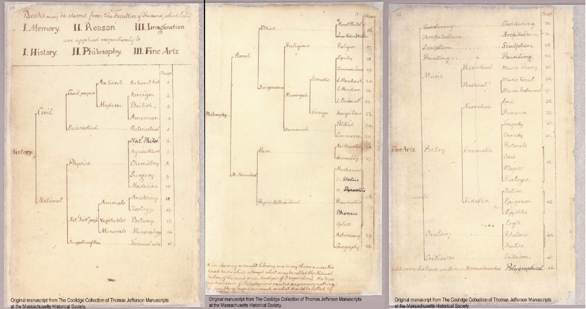
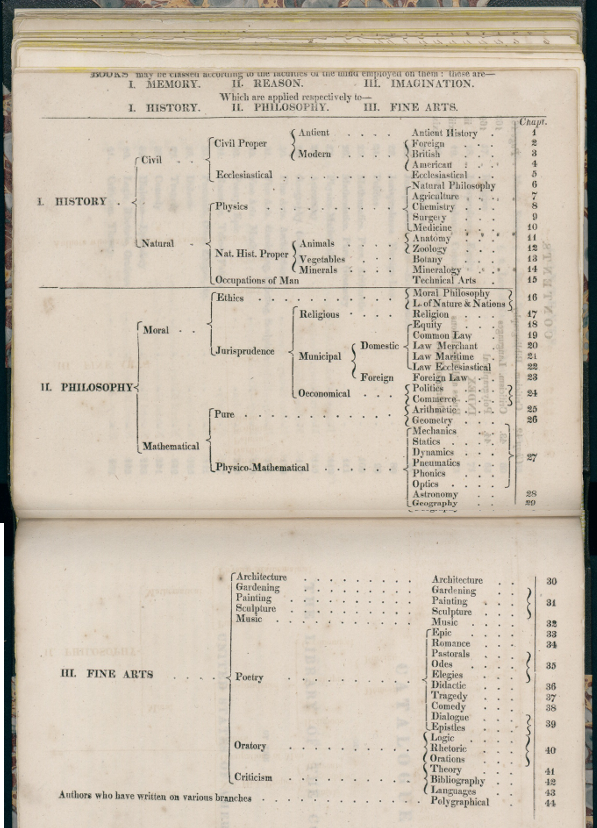
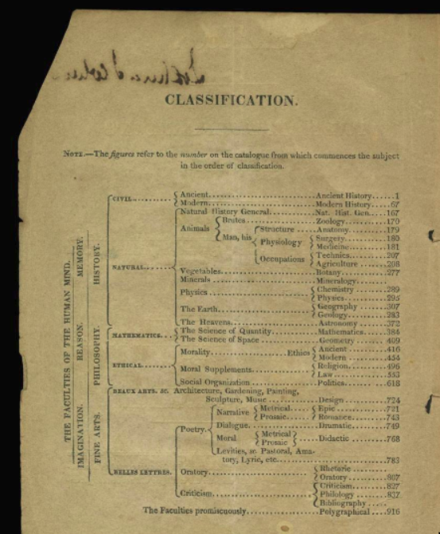

# Jefferson's Library Classification Reconstructed 

<https://doi.org/10.5281/zenodo.1459628>

 Jakob Voß

2018-10-15

This dataset contains a machine-readable version of Thomas Jefferson's Classification System. 

## History

Thomas Jefferson collected several thousand books during his lifetime. He organized his collection with a library classification scheme roughly based on a classification of knowledge by Francis Bacon. Jefferson's second library eventually became the Library Of Congress (LOC) in 1815. The LOC continued to use Jefferson's classification until replaced by the Library of Congress Classification (LCC) in 1897. 

As noted by Wilson (1984, p. 624) the classification "went through an interesting process of evolution" including relocation of books between classes. Catalogs of Jefferson's libraries and its classification have been preserved in at least four versions.

### 1783

The *1783 Catalog of Books* is a handwritten list of books in Thomas Jefferson's personal library, eventually sold to the Library of Congress in 1815. Jefferson started the catalog after his first library was destroyed by fire in 1770. The 246-pages manuscript dates from circa 1775-1812 with continuous editing during this time. A [digitized version](https://www.masshist.org/thomasjeffersonpapers/catalog1783) is available. Jefferson outlined his classification on pages [10](https://www.masshist.org/thomasjeffersonpapers/doc?id=catalog1783_10), [11](https://www.masshist.org/thomasjeffersonpapers/doc?id=catalog1783_11), and [12](https://www.masshist.org/thomasjeffersonpapers/doc?id=catalog1783_10).

### 1815

Jefferson created a handwritten copy of his catalog around 1812 and offered his collection to the destroyed Library of Congress. George Watterston, the Librarian of Congress, published the printed catalog in 1815. He kept Jefferson's chapters but listed books in each chapter alphabetically. The catalog [has been digitized](http://hdl.loc.gov/loc.rbc/Jefferson.04556.2) with the classification depicted on page [6](https://www.loc.gov/resource/rbc0001.2007jeff04556/?sp=6) and [7](https://www.loc.gov/resource/rbc0001.2007jeff04556/?sp=7).

### 1823

In 1823 Nicholas Philip Trist, Jefferson's private secretary and grandson-in-law, recreate the 1812 Catalog which had been modified by Watterston's alphabetical arrangement. Trist's manuscript was rediscovered in the 1980s and [has been digitized](https://www.wdl.org/en/item/3000/) later. Jefferson's classification is not included explicitly but only as chapter headings. The Thomas Jefferson Foundation [refers to the 1815 classifcation](http://tjlibraries.monticello.org/transcripts/trist/trist.html) as table of contents of the Trist catalog.

### 1829

After selling his personal library to the Library of Congress, Jefferson assembled a new collection which was sold after his death. The catalog of this library, printed in as auction catalog 1829, contains the classification at page 3. The catalog [has been digized](https://www.thehenryford.org/collections-and-research/digital-collections/artifact/384739/) by the Henry Ford Archive.

This classification includes auction lot numbers instead of caption numbers and differs at several places from the previous library classification.

## Related works

E. Millicent Sowerby reconstructed Jefferson's catalog from 1815 based on the 1783 Catalog of Books. Her version of the classification is identical to the 1815 version except for some captions, inclusion of sub-chapters and use of latin class numbers. This version may be used as alternative view to the classification but it has not been processed yet for this analysis.

In 2007 the community of the social cataloging application [LibraryThing](https://librarything.com) started to catalog all books held by Thomas Jefferson into a "legacy library". The catalog includes the full 1815 collection with 5683 records so far. The library uses tags based on Jefferson's classification. [Their outline](https://wiki.librarything.com/index.php/1783_Catalog_Classification) includes chapter subdivisions given up by Watterston's alphabetical ordering in 1815. Divisions of chapter 24 (Oeconomical Law) should be taken into account for this analysis.

The Massachusetts Historical Society compiled a [Timeline of Jefferson's Catalog](https://www.masshist.org/thomasjeffersonpapers/catalog1783/catalog_timeline.php) and the Thomas Jefferson Foundation provides [description and transcripts of Jefferson's catalogs](http://tjlibraries.monticello.org/browse/browse.html) including more minor catalogs. Their classifications only differ in chapter headings (e.g. renaming of "Cosmology" to "natural philosophy").

## The dataset

## Classification metadata

Jefferson's library classification as abstract work has been entered into Wikidata and into the Basel Register of Thesauri, Ontologies & Classifications (BARTOC) with two URIs:

* <http://bartoc.org/en/node/18722>
* <http://www.wikidata.org/entity/Q52789832>

Three publications used as source of the classification data have been entered into Wikidata/WikiCite for referencing and enrichment:

* [Q57321524](http://www.wikidata.org/entity/Q57321524) *1783 Catalog of Books* (circa 1775-1812)
* [Q57321620](http://www.wikidata.org/entity/Q57321620) *Catalogue of the Library of the United States* (1815)
* [Q57321675](http://www.wikidata.org/entity/Q57321675) *Auction Catalog for Thomas Jefferson's Library* (1829)

## Classification data

The classifications have been digitized as CSV files. The files are archived as part of this publication at <https://doi.org/10.5281/zenodo.1459628> and managed in a GitHub repository at <https://github.com/jakobib/jefferson-library-classification>:

* `jefferson-classification-1783.csv` (Jefferson's second library before sold to Congress)
* `jefferson-classification-1815.csv` (Jefferson's second library when sold to Congress)
* `jefferson-classification-1829.csv` (Jefferson's third library, 1815-1826)

The CSV files include three columns for each class:

* `level`: depth in the classification hierarchy, expressed by one or more `>` characters
* `notation`: caption number or auction number, if available
* `en`: English caption

Classification hierarchy can be constructed from this data. A Markdown version is included for readability, it is automatically created from CSV with script `csv2md.pl`:

* [1783](jefferson-classification-1783.md)
* [1815](jefferson-classification-1815.md)
* [1829](jefferson-classification-1829.md)

Additional work is needed to encode the classification in RDF, in particular definition or URIs for each class. A similar digitization of Bacon's classification and its versions is also advisable.

## License

All digitized content used and included in this data set is out of copyright. I dedicate this work to the public domain with
[CC0 1.0](https://creativecommons.org/publicdomain/zero/1.0/). Proper citation is welcome nevertheless!

## References

* Thomas Jefferson: *1783 Catalog of Books* (circa 1775-1812). Digitized available at <https://www.masshist.org/thomasjeffersonpapers/catalog1783/>.

* George Watterston, Thomas Jefferson: *Catalogue of the Library of the United States*. (1815). Digitized available at <http://hdl.loc.gov/loc.rbc/Jefferson.04556.2>.

* Thomas Jefferson, Nicholas Philip Trist, George Watterston: *Manuscript Catalogue of Thomas Jefferson's Library* (1823). Digitized available at <https://www.wdl.org/en/item/3000/>.

* Nathaniel P. Poor, Thomas Jefferson: *Auction Catalog for Thomas Jefferson's Library* (1829). Digitized available at <https://www.thehenryford.org/collections-and-research/digital-collections/artifact/384739/>.

* E. Millicent Sowerby: Catalogue of the Library of Thomas Jefferson (1952-1959). Library of Congress. Digitized available at <https://catalog.hathitrust.org/Record/001166326>.

* Douglas L. Wilson: *Sowerby Revisited: The Unfinished Catalogue of Thomas Jefferson's Library* (1984). In: *The William and Mary Quarterly*. Vol. 41, No. 4. <https://doi.org/10.2307/1919156>.

* *Legacy Library: Thomas Jefferson* (2007). <https://www.librarything.com/profile/ThomasJefferson>

* Andreas Ledl, Jakob Voß: Describing Knowledge Organization Systems in BARTOC and JSKOS (2016). In: *Term Bases and Linguistic Linked Open Data. Proceedings of TKE 2016*, page 168-178. <http://hdl.handle.net/10760/29366>.
